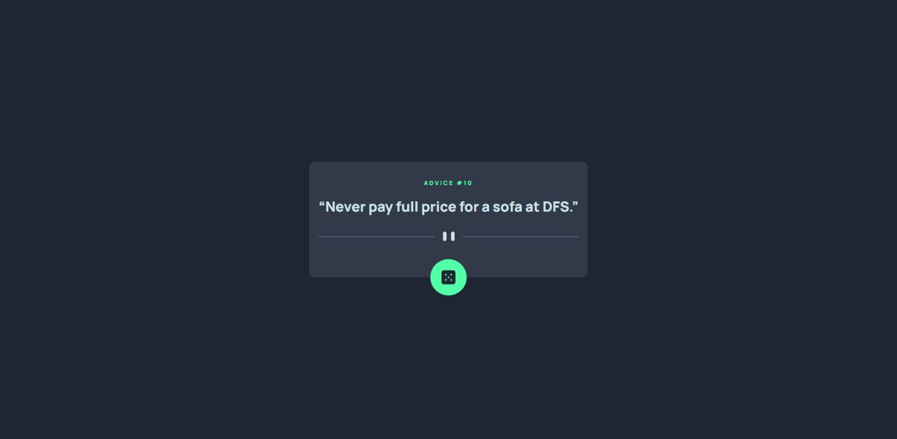

# Frontend Mentor - Advice generator app solution

This is a solution to the [Advice generator app challenge on Frontend Mentor](https://www.frontendmentor.io/challenges/advice-generator-app-QdUG-13db). Frontend Mentor challenges help you improve your coding skills by building realistic projects.

## Table of contents

- [Overview](#overview)
  - [The challenge](#the-challenge)
  - [Links](#links)
- [My process](#my-process)
  - [Built with](#built-with)
  - [What I learned](#what-i-learned)
  - [Continued development](#continued-development)
- [Author](#author)

## Overview

### The challenge

Users should be able to:

- View the optimal layout for the app depending on their device's screen size
- See hover states for all interactive elements on the page
- Generate a new piece of advice by clicking the dice icon

### Links

- Solution URL: [https://github.com/NDOY3M4N/advice-generator-app](https://github.com/NDOY3M4N/advice-generator-app)
- Live Site URL: [https://ndoy3m4n.github.io/advice-generator-app](https://ndoy3m4n.github.io/advice-generator-app)

## My process

### Built with

- Semantic HTML5 markup
- CSS custom properties
- Flexbox
- Mobile-first workflow
- [Svelte](https://svelte.dev/) - Cybernatically enhanced framework
- [Vite](https://vitejs.dev/) - Build tool

### What I learned

This whole challenge helped me learn a little bit about Svelte.

### Continued development

In the future I would like to work with SvelteKit on a project. Maybe for an ecommerce app.

## Author

- Github - [@NDOY3M4N](https://www.github.com/NDOY3M4N)
- Frontend Mentor - [@NDOY3M4N](https://www.frontendmentor.io/profile/NDOY3M4N)
